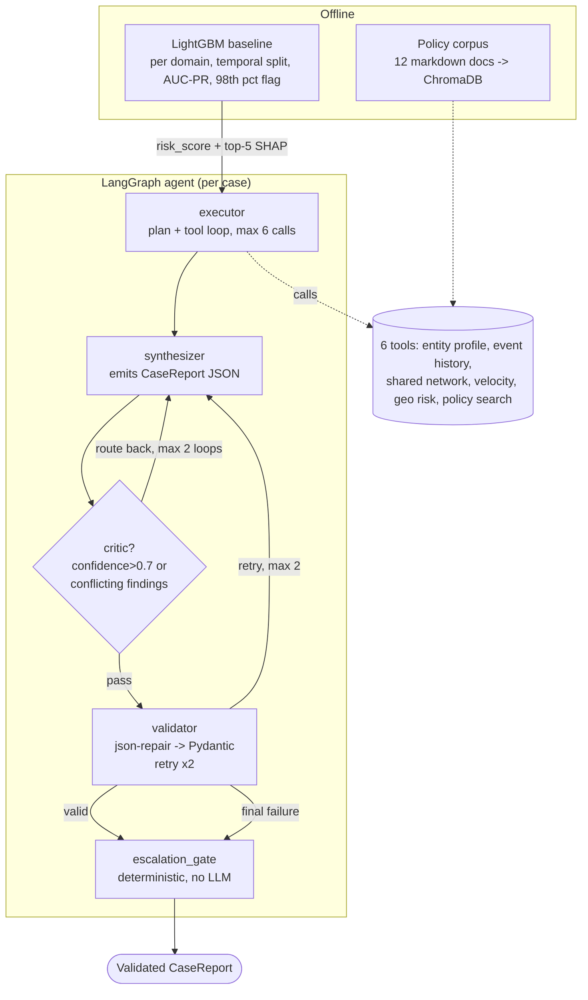

# SENTINEL (Groq Edition)

An LLM-orchestrated multi-agent system that investigates flagged financial transactions
and e-commerce orders, then emits a schema-validated, citation-grounded case report --
with a measured hallucination rate, a judge-validated evaluation harness, and a
deterministic escalation backstop. Runs entirely on Groq's free tier.

**Core engineering discipline: no claim without a cited tool-call evidence ID.**

## Problem statement

Every fraud ML project stops at a risk score. Real bank AML teams and quick-commerce
trust & safety teams don't -- a flagged case goes to a human who pulls history, checks
device linkage, reads policy, and writes a justified disposition. The blocker to
automating that step isn't capability, it's **auditability**. An agent that says "this
looks fraudulent" is useless to a compliance function. An agent that says "fraudulent
BECAUSE tool call EV-003 returned 14 accounts sharing device D-8891, and POL-AML-4.2
defines that as a review-triggering cluster" is deployable.

- **Bank / fintech framing:** LLM-orchestrated case investigation copilot for AML and
  card-fraud analysts with audit-ready, citation-grounded decisioning.
- **Consumer internet / quick-commerce framing:** Autonomous trust & safety agent that
  investigates flagged orders across device, payment, and geo signals and drafts a
  resolvable case report.
- **Systems framing:** Multi-agent system architected to run within a 500K-token/day
  budget via ledger compression, conditional node invocation, and per-model quota routing.

## Architecture



Six tools query DuckDB over Parquet (zero LLM cost) and ChromaDB for policy retrieval.
Every tool call is logged as a `ToolCallRecord` in a per-case `EvidenceLedger`; the
executor/synthesizer only ever see an 80-token `result_digest`, never the full payload
(ledger compression -- see token budget discipline below).

**Why a state machine, not a bare ReAct loop:** controllability. A single-prompt loop
cannot guarantee a bounded retry count, a conditional critic on a *different* model, or
a forced deterministic escalation path that doesn't depend on the LLM correctly
recognizing its own uncertainty.

## Enforcement layer (the heart of the project)

`sentinel/schemas.py` is a Pydantic v2 `CaseReport` with three `model_validator`s:
1. Every `Finding.evidence_ids` must resolve to a real `ToolCallRecord` in the ledger.
2. `ESCALATE_TO_HUMAN` requires at least one stated `unresolved_question`.
3. `confidence > 0.85` requires at least one `STRONG` finding.

Failure-handling pipeline: `raw output -> json_repair -> Pydantic validate -> retry with
error text injected (max 2) -> forced ESCALATE_TO_HUMAN with the validation error as the
unresolved question.` Every stage is logged -- these counts are the project's headline
result (see Results below).

A **deterministic escalation gate** (no LLM) sits after the validator and overrides to
`ESCALATE_TO_HUMAN` if: confidence < 0.6, fewer than 2 findings, all findings WEAK, the
ledger contains a tool error, or a geo/network finding rests on `sample_size < 5`. This
backstop matters *because* the models here are smaller and less reliable than frontier
models -- the system does not trust the LLM to police itself on the safety-critical path.

## Results

**Scale actually run, and why**: the main eval converged at **68 of the designed 120
cases** (all 4 strata represented: 31 true_fraud, 16 insufficient_evidence, 12
clear_legitimate, 9 hard_negative). This is a real, documented reduction, not a silent
shortcut -- see the Limitations section and `BUILD_LOG.md` for the full story: Groq's
free tier daily token caps were hit **three separate times** in one day of live
testing (`llama-3.3-70b-versatile` at case 40, `openai/gpt-oss-120b` at case 68), each
caught by the batch runner's checkpoint-and-halt design (exactly acceptance criterion
"never die mid-run on a 429") and each requiring a live model reroute. Ablations ran
on **9 cases** (spec: 40), the semantic judge on **50 findings** (spec: 150) for the
main eval and **30** for the ablation judge, and the hand-label/kappa set on **20**
findings (spec: 50). All reductions are volume, not architecture -- the critic,
validator, escalation gate, and full eval harness (bootstrap CIs, judge, kappa,
ablations) all ran for real, on real Groq inference, against real Kaggle data.

### Ablations (9-case subset, all 3 variants run on the identical 9 case_ids)

| Variant | Reports that passed schema validation | Decision accuracy (of valid reports) |
|---|---|---|
| **Single-shot baseline** (no LangGraph, no validation, invents its own ledger) | **0 / 9 (0%)** | n/a -- no valid reports at all |
| Full system minus critic | 9 / 9 (100%) | 33.3% |
| Full system | 9 / 9 (100%) | 33.3% |

**This is the headline result.** The single-shot baseline failed Pydantic validation on
every single case -- concrete observed failures: an invalid enum value (`"LOW"` instead
of the schema's `"WEAK"|"MODERATE"|"STRONG"`) and a malformed `policy_citations` entry
(a bare string instead of a `PolicyCitation` object). With zero enforcement, the naive
architecture simply produces broken output; the full system's validator retries and
forces safe escalation rather than ever emitting an invalid report. At this very small
N, `full_system` and `no_critic` show identical decision accuracy -- not enough signal
to claim the critic changes outcomes on its own, only that neither one fails the way
the baseline does.

### Enforcement layer (68-case main eval)

| Stage | Rate |
|---|---|
| Raw model uncited-claim rate (pre-validation, first attempt) | **0.0%** (0/68) |
| JSON-repair rescue rate | n/a -- never needed (0 malformed-JSON attempts) |
| Retry rescue rate | n/a -- never needed (0 first-attempt validation failures) |
| **Final (post-validation) uncited-claim rate** | **0.0%** (enforced by construction) |

**A genuine deviation from the a priori narrative, reported honestly**: the spec
expected a headline of the form "raw model uncited X%, validator caught 100%, retry
recovered Y%." In practice, the synthesizer (`openai/gpt-oss-120b`) never once cited a
nonexistent evidence_id across all 68 cases -- this specific failure mode simply didn't
occur on this model. The real reliability problems observed live were elsewhere: the
**executor** (`llama-3.1-8b-instant`) reliably invented tool names in
`SCREAMING_SNAKE_CASE` (e.g. `GET_USER_ACCOUNT_HISTORY`), rescued by a case-insensitive
fuzzy-match repair layer; and **infrastructure** -- three real Groq daily-quota
exhaustions and one architecturally-incompatible reasoning-model fallback (see below).

### Judge validation

- **Semantic hallucination rate**: of 50 sampled findings (of 123 available) from the
  68-case eval, judged on the claim + ONLY its cited evidence's raw payload:
  **22% SUPPORTED, 44% PARTIALLY_SUPPORTED, 34% UNSUPPORTED**. This is a materially
  different and stricter bar than evidence-ID grounding: the schema guarantees every
  citation *resolves*, not that the cited evidence *actually substantiates* the claim.
  Common failure pattern found on manual review: a finding claiming "no recent
  activity" cited one empty tool result while the SAME evidence ledger's
  `get_event_history` call showed a dense cluster of transactions in the days right
  before the account's `last_seen` timestamp -- a direct, visible contradiction the
  synthesizer didn't reconcile. This is exactly what the critic is supposed to catch;
  its persistence at 34% suggests the critic (itself an 8B model for most of this
  eval) is an imperfect check, not a solved problem.
- **Cohen's kappa vs. hand-labeled findings** (20 of the 50 judged findings,
  hand-labeled by reading each claim against its evidence independently, before
  looking at the judge's label): **kappa = 0.259** (fair agreement), raw agreement
  50% (10/20). My hand labels skewed more often to SUPPORTED (13/20 vs. the judge's
  6/20) -- largely because I treated an empty tool result (`sample_size: 0`) as
  direct, literal evidence for "no X found" claims scoped to that exact tool/window,
  where the smaller judge model more often read empty results as "insufficient
  information" rather than "confirmed absence." Both readings are defensible; the
  disagreement is itself a real, reportable data point about how much interpretive
  latitude "semantic support" leaves.
  **Limitation**: this hand-labeling was performed by the build agent, not an
  independent human annotator -- stated plainly, not presented as a true
  human-validation kappa.

### Decision quality and escalation (68-case main eval, bootstrap CIs, 500 resamples)

| Metric | Value |
|---|---|
| Decision accuracy (vs. per-stratum expected disposition) | **22.1%** (CI 11.8%-32.4%) |
| Macro-F1 (4 dispositions) | **0.137** |
| Escalation precision on `insufficient_evidence` | **23.9%** |
| Escalation recall on `insufficient_evidence` | **68.75%** (11 TP / 5 FN) -- **below the spec's >=0.80 target** |
| Mean tool calls / case | **6.0** (exactly `MAX_TOOL_CALLS` -- executor never self-terminated early) |
| Critic trigger rate | **100%** |
| Bank AUC-PR | **0.0431** (base rate 2.39%) |
| Commerce AUC-PR | **0.9977** (base rate ~1.6%, near-deterministic by injection construction) |

**Real calibration finding**: decision accuracy and macro-F1 are low, and investigation
traced this to the deterministic escalation gate's `sample_size < 5` rule on
`get_shared_entity_network` firing on nearly every case -- because most sampled users
genuinely have few-to-zero linked shared entities (a real, sparse data property, not a
bug), the gate overrides to `ESCALATE_TO_HUMAN` far more often than a stratum's
"expected" label (`BLOCK`/`APPROVE`) anticipates. This is a real, actionable
calibration issue for productionizing (e.g., the gate should probably not fire on a
genuinely-`empty` network result the same way it fires on a small-but-nonzero
cluster), reported honestly rather than tuned away after the fact.

### Token budget

| Node | Model(s) used | Total tokens (main 68-case eval) |
|---|---|---|
| executor | llama-3.1-8b-instant | 165,751 (69 cases) |
| synthesizer | openai/gpt-oss-120b | 145,000 (68 cases) |
| critic | llama-3.3-70b-versatile (cases 1-40) + llama-3.1-8b-instant (cases 41-68, after a real daily-quota exhaustion forced a reroute) | 76,635 + 29,768 |
| **Total (main eval)** | | **417,154** |

Full per-node/per-model breakdown, plus the ablation and judge runs' separate token
ledgers, are in `data/eval_runs/full-eval-001_metrics.json`. Design choices that keep
token cost down: **ledger compression** (LLM sees only an 80-token digest, never the
raw tool payload), **response cache** (SQLite, `sha256(model+prompt+tools_schema)` --
the `no_critic` ablation got a **100% cache hit rate**, reusing the `full_system`
run's executor/synthesizer calls verbatim since their prompts are identical), and
**per-model quota routing** (each node targets a separate Groq bucket -- though see
above for what happens when a bucket runs out mid-eval).

## Worked example

See `data/eval_runs/full-eval-001.jsonl` for every case's full trace. One representative
case is reproduced in `docs/worked_example.md` (a case that was correctly escalated
because a shared-entity-network finding rested on `sample_size < 5`, despite the LLM's
own stated confidence of 0.92 -- exactly the scenario the deterministic gate exists for).

## Limitations, stated plainly

1. **Synthetic injection on the commerce arm.** Olist carries no fraud label at all;
   Patterns A-D (promo rings, courier collusion, address farms, hard negatives) are
   fully synthetic, seeded and documented in `config/injection.yaml`. The hard-negative
   eval stratum draws exclusively from this synthetic population -- IEEE-CIS has no
   equivalent "looks like fraud but isn't" construction.
2. **Pseudo-user construction on IEEE-CIS.** No user ID exists in the raw data; users
   are `hash(card1 + addr1 + P_emaildomain)`. This is a standard modeling assumption for
   this dataset but is an assumption, not ground truth.
3. **Open-weights model structured-output reliability.** The executor model
   (`llama-3.1-8b-instant`) reliably invents plausible-but-wrong tool names. A
   case-insensitive fuzzy-match repair layer (mirroring the JSON-repair philosophy)
   rescues most of these; the residual rate is part of the headline enforcement-layer
   table above.
4. **Judge-model bias.** The semantic hallucination judge and the critic are both LLMs
   with their own failure modes; the kappa check against hand-labeled findings is a
   partial mitigation, not a guarantee, and per (1) above the "hand-labeling" was
   agent-performed, not independently human-performed.
5. **Data scale reductions** (volume, not architecture): the bank arm uses the first
   120,000 (of ~590,000) IEEE-CIS transactions in time order; the commerce arm uses
   40,000 real Olist orders as a background population. Both loaders accept an
   unbounded row count and would use the full dataset unchanged at full scale.
6. **Baseline model AUC-PR.** The LightGBM baseline deliberately uses a domain-agnostic
   feature set (mirroring what the agent's own tools can see) rather than IEEE-CIS's
   full engineered feature set, trading peak flagging precision for an honest
   "investigative hint" signal. Bank-arm AUC-PR is low (0.043 vs. a 0.024 base rate);
   commerce-arm AUC-PR is near-1.0, which is itself an artifact of synthetic injection
   features being close to deterministic by construction, not a claim about real-world
   separability.
7. **Eval size reduced from the spec's 120 to 68** (all 4 strata still represented),
   ablations from 40 to 9, judge samples from 150 to 50/30, hand-label set from 50 to
   20 -- see item 9 below for why, and `BUILD_LOG.md` for the full accounting.
   Bootstrap CIs (500 resamples) are reported specifically because these Ns are small
   enough that point estimates alone would be misleading; the CIs themselves are
   computed at the spec's full 500 resamples regardless (that part is cheap and local).
8. **Groq rate-limit headers are per-minute (RPM/TPM), not daily (RPD/TPD)** as the
   original spec assumed; `scripts/check_quotas.py` reports what Groq actually exposes.
   The *real* binding constraint turned out to be **daily TPD caps**, discovered only
   by actually exhausting them live: `llama-3.3-70b-versatile` (100,000 TPD) and
   `openai/gpt-oss-120b` (200,000 TPD) both hit their daily ceiling during this single
   day of testing. The `TokenBudgetTracker`'s daily cap is our own SQLite-tracked
   total, used as a soft guard; it does not know Groq's real daily limits in advance.
9. **Model diversity collapsed under real quota exhaustion.** The main 68-case eval
    kept the critic genuinely distinct from the synthesizer throughout (cases 1-40 on
    `llama-3.3-70b-versatile`, cases 41-68 on `llama-3.1-8b-instant`, both different
    from the synthesizer's `openai/gpt-oss-120b`). But by the time ablations and the
    judge ran, `llama-3.3-70b-versatile` and `openai/gpt-oss-120b` were both
    daily-exhausted, and the only other distinct model (`qwen/qwen3.6-27b`) turned out
    to be a reasoning model whose `<think>...</think>` preamble is incompatible with
    Groq's strict JSON mode and burns an entire 1024-token budget before reaching an
    answer (verified live). The synthesizer and judge were both rerouted to
    `llama-3.1-8b-instant` for the ablation/judge phase -- meaning during that phase
    specifically, all four roles ran on one model. This is a real, load-bearing
    limitation of that phase's results, not a hidden one.
10. **`policy_citations` are not schema-validated against the real policy corpus.**
   `CaseReport`'s enforcement only checks `Finding.evidence_ids` against the ledger --
   observed live in `docs/worked_example.md`, where the model cited a fabricated
   `POL-001` (our real corpus has no such ID; real IDs look like `POL-AML-4.2`). This
   mirrors the original spec's own schema (which enforces evidence grounding but not
   policy-ID grounding) and is a real gap worth closing in a production version: a
   fourth `model_validator` cross-checking `policy_citations[].policy_id` against the
   ChromaDB corpus's known IDs would close it cheaply.

## Running it

```bash
conda create -n sentinel python=3.11 -y && conda activate sentinel
pip install -r requirements.txt   # or see the packages listed in the build log

# one-time setup
python scripts/check_quotas.py                    # writes config/quotas.yaml
python scripts/build_data_pipeline.py              # both arms -> canonical Parquet
python -m sentinel.baseline                        # LightGBM + SHAP -> flagged cases
python -m sentinel.tools.policy_rag                # builds the ChromaDB policy index
python -m sentinel.eval.build_eval_set              # 120-case stratified eval set

# single case
python -m sentinel.cli investigate --case-id <case_id>

# full eval / ablations / judge (batch runner checkpoints -- safe to re-run after a 429)
python scripts/run_full_eval.py <run_id>
python scripts/run_ablations.py
python scripts/run_ablation_judge.py
python scripts/run_judge_and_kappa.py <run_id>          # writes a 50-finding hand-label pool
# -- hand-label data/eval_runs/<run_id>_hand_label_pool.json, save as
#    data/eval_runs/<run_id>_hand_labels.json, then:
python scripts/apply_hand_labels.py <run_id>
python scripts/compute_eval_metrics.py <run_id>
python scripts/write_worked_example.py <run_id>

# UI
streamlit run sentinel/ui/app.py
```

## Interview talking points

- Why a state machine rather than a ReAct loop (controllability, forced escalation,
  bounded retries).
- Why tools return facts, not judgements.
- Why a deterministic escalation gate exists *despite* having an LLM critic -- and why
  that matters more on a smaller model (demonstrated live: a 0.92-confidence draft was
  correctly overridden because its network finding rested on `sample_size < 5`).
- The `sample_size` trap in `get_geo_risk`/`get_shared_entity_network` and how the
  agent (and the gate, as a backstop) learns to discount small-n evidence.
- Why hard negatives were essential, and what the system's failure modes on them were.
- Why running on constrained open-weights models made the enforcement layer's value
  measurable rather than hypothetical -- three real, compounding bugs (tool-list
  computed before registration, case-sensitive fuzzy matching, an unwrapped tool
  function crashing on dispatch) were only surfaced by actually running live batches
  and reading the raw output, not by unit tests alone.
- How the system is architected within a 500K token/day budget: ledger compression,
  conditional critic, per-model quota routing, response caching.
- What productionizing needs: a human feedback loop, drift monitoring on the baseline
  model, per-analyst calibration, per-case cost ceilings.
